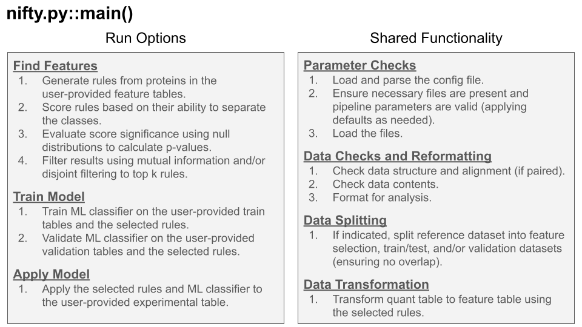

# NIFty
Never Impute Features (thank you).

NIFty is a python program for feature selection (including generation and scoring), model generation, and experimental classification that does not require missing-value imputation, avoids common circular analysis pitfalls by default, and overcomes batch effects. 
The primary application is large molecular data, like proteomics. 
We assume input to be two tables: (1) a table with proteins (or other data) as the columns and samples as the rows, and (2) a table that has the label (class) for each sample. 
The output from our program depends on which functionalty the user would like to run. 
In the 'find_features' mode, the output is a list of the k top features that can be used to train a machine learning classifier to annotate samples. 
In the 'train_model' mode, the output is a trained machine learning model on the selected features. 
In the 'apply_model' mode, the output is a list of sample classifications from applying the trained model on experimental, unlabeled data.
The important thing is that we never impute. We can deal with null values.

Run this program with the following command on the commandline (assuming config.toml exists in the same directory):
> python nifty.py

Run this program with the following command on the commandline (with a custom config filepath):
> python nifty.py -c <config/file/path>

The codebase functions as follows:

## How it works
NIFTfy can be executed in several modes depending on which steps of the pipeline you want to run:
1. **find_features**: Generate and score rules (features) to find the top k features for classification.
2. **train_model**: Train a machine learning classifier using the selected features.
3. **apply_model**: Apply the trained classifier on experimental, unlabeled data.

You can control this behavoir using the config.toml file.
Here are all valid combinations of the three main flags:

## Tutorials and Examples:
- [Full Pipeline](tutorials/full_pipeline_tutorial.md)
- [File Formats and Descriptions](tutorials/file_formats.md)

## Full Pipeline:
The most common use of our tool will be to run the full pipeline. This means that the program will 1. find features, 2. train a model and 3. apply the model. The code and descriptive examples below will help you run the full pipeline.
LINK TO REGRESSION TEST FOLDR
LINK TO REGRESSION TEST CONFIG

### Configuration:
- find_features = true 
- train_model = true 
- apply_model = true
### Requires
- reference_quant_file / feature_quant_file
- reference_meta_file / feature_meta_file
- train_quant_file / reference split
- train_meta_file / reference split
- validate_quant_file / reference split
- validate_meta_file / reference split
- experimental_quant_file
### Produces
- top_k_rules.csv
- trained_model_and_model_metadata.pkl
- model_information.txt
- predicted_classes.tsv

## Feature Selection Only:
Use when you only want the top k rules to later train a model manually or in another run.
### Configuration:
- find_features = true
- train_model = false
- apply_model = false
### Requires
- reference_quant_file / feature_quant_file
- reference_meta_file / feature_meta_file
### Produces
- top_k_rules.csv

## Train Model Only:
Use when you already have a feature file (rules) and want to train a model.
### Configuration:
- find_features = false
- train_model = true
- apply_model = false
### Requires
- feature_file
- train_quant_file
- train_meta_file
- validate_quant_file
- validate_meta_file
### Produces
- trained_model_and_model_metadata.pkl
- model_information.txt

## Apply Model Only:
Use when you already have a trained model and want to classify experimental samples.
### Configuration:
- find_features = false 
- train_model = false 
- apply_model = true
### Requires
- model_file
- experimental_quant_file
### Produces
- predicted_classes.tsv

## Find Features and Train Model:
Use when you want to find the top rules and then train a model using those rules in one run.
### Configuration:
- find_features = true
- train_model = true
- apply_model = false
### Requires
- reference_quant_file / feature_quant_file
- reference_meta_file / feature_meta_file
- train_quant_file / reference split
- train_meta_file / reference split
- validate_quant_file / reference split
- validate_meta_file / reference split
### Produces
- top_k_rules.csv
- trained_model_and_model_metadata.pkl
- model_information.txt

## Train Model and Apply Model:
Use when you want to train a model and then immediately apply it to unlabeled experimental samples.
### Configuration:
- find_features = false
- train_model = true
- apply_model = true
### Requires
- feature_file
- train_quant_file
- train_meta_file
- validate_quant_file
- validate_meta_file
- experimental_quant_file
### Produces
- trained_model_and_model_metadata.pkl
- model_information.txt
- predicted_classes.tsv
